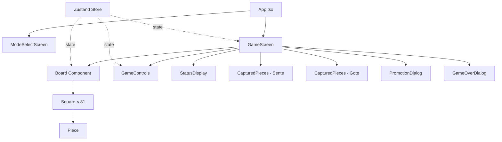
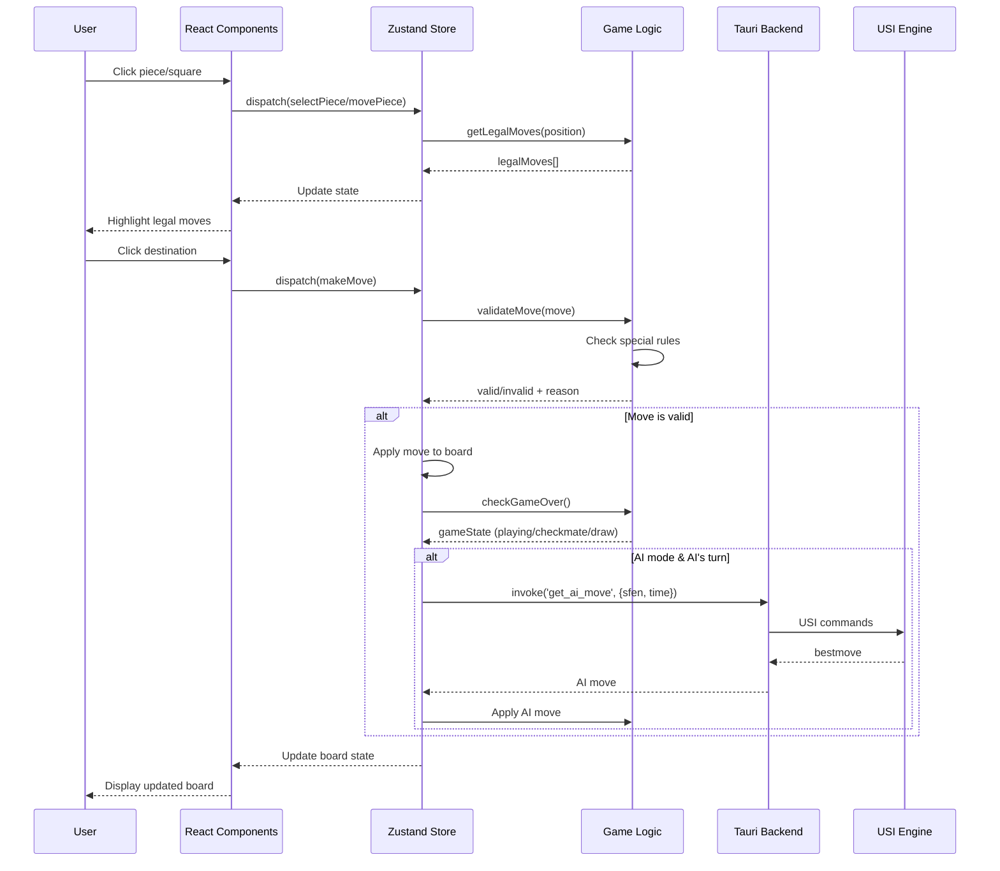
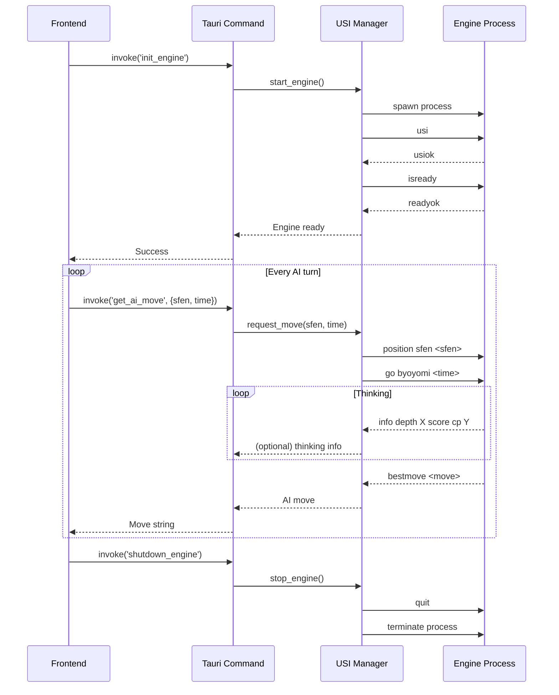

# Shogi Desktop - Architecture Design

## 1. Directory Structure

```
shogi-game/
├── src/                          # Frontend source
│   ├── components/               # React components
│   │   ├── Board/
│   │   │   ├── Board.tsx        # Main board component
│   │   │   ├── Square.tsx       # Individual square
│   │   │   └── Piece.tsx        # Piece component
│   │   ├── CapturedPieces/
│   │   │   └── CapturedPieces.tsx
│   │   ├── GameControls/
│   │   │   └── GameControls.tsx # New game, resign buttons
│   │   └── Dialogs/
│   │       ├── PromotionDialog.tsx
│   │       └── GameOverDialog.tsx
│   ├── logic/                    # Game logic (framework-agnostic)
│   │   ├── types.ts             # Core type definitions
│   │   ├── board.ts             # Board state management
│   │   ├── moves.ts             # Legal move generation
│   │   ├── validation.ts        # Special rules validation
│   │   └── judge.ts             # Win/loss/draw判定
│   ├── store/                    # Zustand state management
│   │   └── gameStore.ts         # Global game state
│   ├── hooks/                    # Custom React hooks
│   │   └── useGame.ts           # Game logic hooks
│   ├── utils/                    # Utility functions
│   │   ├── sfen.ts              # SFEN parser/serializer
│   │   └── notation.ts          # Move notation converter
│   ├── App.tsx                   # Root component
│   ├── main.tsx                  # Entry point
│   └── styles.css                # Tailwind CSS
├── src-tauri/                    # Rust backend
│   ├── src/
│   │   ├── main.rs              # Tauri entry point
│   │   ├── usi/
│   │   │   ├── mod.rs           # USI protocol module
│   │   │   ├── engine.rs        # Engine process management
│   │   │   ├── parser.rs        # USI response parser
│   │   │   └── commands.rs      # USI command builder
│   │   └── commands.rs          # Tauri commands
│   ├── Cargo.toml
│   └── tauri.conf.json
├── resources/                    # Bundled resources
│   └── engines/
│       ├── YaneuraOu-win.exe
│       ├── YaneuraOu-mac
│       └── YaneuraOu-linux
├── tests/                        # Unit tests
│   ├── logic/
│   │   ├── board.test.ts
│   │   ├── moves.test.ts
│   │   └── validation.test.ts
│   └── integration/
│       └── game-flow.test.ts
├── package.json
├── tsconfig.json
├── tailwind.config.js
└── vite.config.ts
```

## 2. Component Architecture



## 3. Data Flow Architecture



## 4. State Management (Zustand)

```typescript
interface GameState {
  // Board state
  board: (Piece | null)[][]; // 9x9 array
  capturedPieces: {
    sente: PieceType[];
    gote: PieceType[];
  };

  // Game status
  currentPlayer: Player;
  selectedSquare: Position | null;
  selectedCapturedPiece: PieceType | null;
  legalMoves: Position[];
  lastMove: Move | null;
  gameStatus: 'playing' | 'checkmate' | 'stalemate' | 'repetition';
  winner: Player | null;

  // Mode
  gameMode: 'pvp' | 'pve';
  aiLevel: 'easy' | 'medium' | 'hard';

  // History (for repetition detection)
  positionHistory: string[]; // SFEN strings

  // Actions
  selectSquare: (pos: Position) => void;
  selectCapturedPiece: (piece: PieceType) => void;
  makeMove: (move: Move) => void;
  resign: () => void;
  newGame: (mode: 'pvp' | 'pve', level?: string) => void;
}
```

## 5. Board Internal Representation

### 5.1 Coordinate System
```
後手側
  9  8  7  6  5  4  3  2  1
┌─┬─┬─┬─┬─┬─┬─┬─┬─┐
│ │ │ │ │ │ │ │ │ │ 一 (0)
├─┼─┼─┼─┼─┼─┼─┼─┼─┤
│ │ │ │ │ │ │ │ │ │ 二 (1)
├─┼─┼─┼─┼─┼─┼─┼─┼─┤
│ │ │ │ │ │ │ │ │ │ 三 (2)
├─┼─┼─┼─┼─┼─┼─┼─┼─┤
│ │ │ │ │ │ │ │ │ │ 四 (3)
├─┼─┼─┼─┼─┼─┼─┼─┼─┤
│ │ │ │ │ │ │ │ │ │ 五 (4)
├─┼─┼─┼─┼─┼─┼─┼─┼─┤
│ │ │ │ │ │ │ │ │ │ 六 (5)
├─┼─┼─┼─┼─┼─┼─┼─┼─┤
│ │ │ │ │ │ │ │ │ │ 七 (6)
├─┼─┼─┼─┼─┼─┼─┼─┼─┤
│ │ │ │ │ │ │ │ │ │ 八 (7)
├─┼─┼─┼─┼─┼─┼─┼─┼─┤
│ │ │ │ │ │ │ │ │ │ 九 (8)
└─┴─┴─┴─┴─┴─┴─┴─┴─┘
(8)(7)(6)(5)(4)(3)(2)(1)(0)
先手側

Position: { row: 0-8, col: 0-8 }
```

### 5.2 Data Structure
- **Array-based representation** (not bitboard for simplicity)
- Each cell: `Piece | null`
- Piece: `{ type: PieceType, owner: Player }`

## 6. Legal Move Generation Algorithm

```typescript
function getLegalMoves(board: Board, pos: Position): Position[] {
  const piece = board[pos.row][pos.col];
  if (!piece) return [];

  // 1. Get basic movement pattern for piece type
  const candidateMoves = getPieceMovementPattern(piece.type, pos, piece.owner);

  // 2. Filter out-of-bounds moves
  const inBoundsMoves = candidateMoves.filter(isInBounds);

  // 3. Filter moves blocked by own pieces
  const validMoves = inBoundsMoves.filter(move => {
    const target = board[move.row][move.col];
    return !target || target.owner !== piece.owner;
  });

  // 4. Filter moves that would leave king in check
  const safeMoves = validMoves.filter(move => {
    const newBoard = applyMove(board, { from: pos, to: move });
    return !isKingInCheck(newBoard, piece.owner);
  });

  return safeMoves;
}
```

## 7. Special Rules Validation

### 7.1 二歩 (Double Pawn)
```typescript
function isNifuViolation(board: Board, move: Move, player: Player): boolean {
  if (move.piece !== 'FU' || move.from !== null) return false; // Not a pawn drop

  const col = move.to.col;
  for (let row = 0; row < 9; row++) {
    const piece = board[row][col];
    if (piece?.type === 'FU' && piece.owner === player) {
      return true; // Already a pawn in this column
    }
  }
  return false;
}
```

### 7.2 打ち歩詰め (Pawn Drop Checkmate)
```typescript
function isUchifuzumeViolation(board: Board, move: Move, player: Player): boolean {
  if (move.piece !== 'FU' || move.from !== null) return false;

  // 1. Apply pawn drop temporarily
  const newBoard = applyMove(board, move);

  // 2. Check if opponent king is in checkmate
  const opponent = player === 'sente' ? 'gote' : 'sente';
  if (!isCheckmate(newBoard, opponent)) return false;

  // 3. Check if checkmate is ONLY because of the pawn (king can't escape)
  // AND no other piece can capture the pawn or block
  // This is the critical difference from normal checkmate
  return isPawnDropDirectCheckmate(newBoard, move, opponent);
}
```

### 7.3 千日手 (Repetition)
```typescript
function isRepetition(positionHistory: string[], currentSfen: string): boolean {
  const count = positionHistory.filter(sfen => sfen === currentSfen).length;
  return count >= 4; // Same position 4 times = draw
}
```

## 8. Checkmate/Win Condition判定

```typescript
function checkGameState(board: Board, player: Player): GameState {
  // 1. Check if king is in check
  const inCheck = isKingInCheck(board, player);

  // 2. Get all legal moves for current player
  const allLegalMoves = getAllLegalMoves(board, player);

  if (allLegalMoves.length === 0) {
    if (inCheck) {
      return 'checkmate'; // 詰み
    } else {
      return 'stalemate'; // ステイルメイト (将棋では通常発生しない)
    }
  }

  return 'playing';
}
```

## 9. USI Communication Flow



## 10. Rust USI Implementation

```rust
// src-tauri/src/usi/engine.rs
pub struct UsiEngine {
    child: Child,
    stdin: ChildStdin,
    stdout: BufReader<ChildStdout>,
}

impl UsiEngine {
    pub fn new(engine_path: &str) -> Result<Self> {
        let mut child = Command::new(engine_path)
            .stdin(Stdio::piped())
            .stdout(Stdio::piped())
            .spawn()?;

        let stdin = child.stdin.take().unwrap();
        let stdout = BufReader::new(child.stdout.take().unwrap());

        Ok(UsiEngine { child, stdin, stdout })
    }

    pub fn send_command(&mut self, cmd: &str) -> Result<()> {
        writeln!(self.stdin, "{}", cmd)?;
        self.stdin.flush()?;
        Ok(())
    }

    pub fn read_response(&mut self) -> Result<String> {
        let mut line = String::new();
        self.stdout.read_line(&mut line)?;
        Ok(line.trim().to_string())
    }

    pub fn init(&mut self) -> Result<()> {
        self.send_command("usi")?;
        loop {
            let response = self.read_response()?;
            if response == "usiok" { break; }
        }

        self.send_command("isready")?;
        loop {
            let response = self.read_response()?;
            if response == "readyok" { break; }
        }

        Ok(())
    }

    pub fn get_best_move(&mut self, sfen: &str, time_ms: u32) -> Result<String> {
        self.send_command(&format!("position sfen {}", sfen))?;
        self.send_command(&format!("go byoyomi {}", time_ms))?;

        loop {
            let response = self.read_response()?;
            if response.starts_with("bestmove") {
                let parts: Vec<&str> = response.split_whitespace().collect();
                return Ok(parts[1].to_string());
            }
        }
    }
}
```

## 11. Edge Cases & Error Handling

### 11.1 将棋ロジック Edge Cases
- ✅ 二歩: Column-based validation before pawn drop
- ✅ 打ち歩詰め: Special checkmate validation for pawn drops
- ✅ 行き所のない駒: Validate piece can move from destination
- ✅ 千日手: Track SFEN history, compare current position
- ✅ 王手放置: Filter out moves that leave king in check

### 11.2 USI Communication Errors
- Engine process fails to start → Show error dialog, disable AI mode
- Engine crashes mid-game → Detect process termination, offer to restart
- Invalid SFEN sent to engine → Validate SFEN before sending
- Timeout waiting for bestmove → Implement timeout (30s default), force stop

### 11.3 Tauri + React State Sync
- Use Tauri events for async engine responses
- Store engine state in Rust, not React (avoid race conditions)
- Lock game state during AI thinking to prevent user moves

## 12. Self-Review

### 12.1 Architecture Strengths
- ✅ Clear separation: Logic (framework-agnostic) ↔ UI (React) ↔ Backend (Rust)
- ✅ Zustand provides simple state management without Redux boilerplate
- ✅ USI protocol handled entirely in Rust for safety and performance
- ✅ Testable: Logic layer can be unit tested without UI

### 12.2 Potential Issues & Solutions

**Issue 1: Performance with deep move validation**
- Solution: Memoize legal move calculations, only recalculate on board change

**Issue 2: 打ち歩詰め detection is complex**
- Solution: Implement simplified version first, enhance later with proper tsume solver

**Issue 3: SFEN serialization errors**
- Solution: Use well-tested SFEN library or thoroughly test custom implementation

**Issue 4: Engine binary platform detection**
- Solution: Use Tauri's platform API to select correct binary at runtime

---

## Ready for Phase 3 Implementation

This architecture provides:
1. ✅ Scalable directory structure
2. ✅ Clear data flow between frontend/backend
3. ✅ Robust state management design
4. ✅ Comprehensive legal move generation algorithm
5. ✅ USI protocol communication design with error handling
